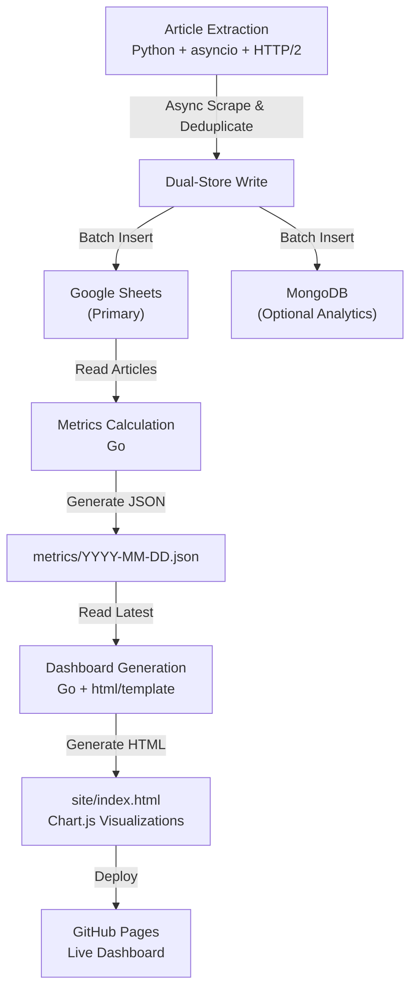

# 📚 Personal Reading Analytics Dashboard

A self-built fully automated reading analytics dashboard with zero infrastructure, refreshed automatically to turn personal data into actionable insights.

---

## 🌿 Design Philosophy

This project is built to reflect how I believe small, personal tools should work:

- **Zero infrastructure** → No servers, databases, or cloud costs. Runs entirely on GitHub (Actions + Pages).  
- **Fully automated** → Scheduled GitHub Actions keep data fresh—no manual runs or home servers.  
- **Cost-effective** → Uses only free tiers (GitHub, Google Sheets API)—proving powerful automation doesn’t require budget.

---

## 📊 What It Shows

**Key Metrics Section:**
- **Total articles**: Tracking total articles across currently supported sources
- **Read rate**: Percentage of articles completed with visual highlighting
- **Reading statistics**: Read count, unread count, and average articles per month
- **Highlight badges**: Top read rate source, most unread source, current month's read articles

**7 Interactive Visualizations (Chart.js):**
1. **Year Breakdown**: Bar chart showing article distribution by publication yearE
2. **Read/Unread by Year**: Stacked bar chart with reading progress across years
3. **Monthly Breakdown**: Toggle between total articles (line chart) and by-source distribution (stacked bar)
4. **Read/Unread by Month**: Seasonal reading patterns across all months
5. **Read/Unread by Source**: Horizontal stacked bars comparing progress per provider
6. **Unread Age Distribution**: Age buckets (<1 month, 1-3 months, 3-6 months, 6-12 months, >1 year)
7. **Unread by Year**: Identifies which years have the most unread backlog

**Source Analytics:**
- Per-source statistics with read/unread split and read percentages
- Substack per-author average calculation (total articles ÷ author count)
- Top 3 oldest unread articles with clickable links, dates, and age calculations
- Source metadata showing when each provider was added to tracking

### Supported Sources

Currently extracting articles from:

- freeCodeCamp
- Substack
- GitHub (Added 2024-03-18)
- Shopify (Added 2025-03-05)
- Stripe (Added 2025-11-19)  

---

## 🔗 Live Dashboard

👉 [Live Demo](https://victoriacheng15.github.io/personal-reading-analytics-dashboard/)

---

## 🛠 Tech Stacks

---

## 🛠️ Technical Overview

### Data Pipeline: Articles → Metrics → Dashboard

**Article Extraction**: Python async web scrapers (Beautiful Soup + httpx with HTTP/2) extract articles from 5 engineering blogs, normalize titles for deduplication, and write to dual stores (Google Sheets primary, MongoDB optional). Runs daily at 6am UTC.

**Metrics Calculation**: Go program reads articles from Google Sheets API, calculates 23 comprehensive metrics (by source, by year/month, read/unread splits, age distribution, oldest unread articles), outputs timestamped JSON. Creates PR every Friday at 1am UTC.

**Dashboard Generation**: Go program reads latest metrics JSON, uses `html/template` to generate responsive HTML with 7 Chart.js visualizations, embedded CSS, and self-contained JavaScript. Auto-deploys to GitHub Pages on merge.

### Documentation

For deep technical details, see the architecture docs:  

- [Extraction Pipeline Design](docs/extraction_architecture.md)  
- [Dashboard Pipeline Design](docs/dashboard_architecture.md)  
- [GitHub Actions Workflows](docs/github_actions.md)  
- [Jenkins CI/CD (Learning Experiment)](docs/jenkins.md) - Educational implementation only; production relies entirely on GitHub Actions.

---

## 📖 How This Project Evolved

Learn about the journey of this project: from local-only execution, to Docker containerization, to fully automated GitHub Actions workflows.

[Read Part 1: Article Extraction Pipeline](https://victoriacheng15.vercel.app/blog/from-pi-to-cloud-automation)

**Part 2: Dashboard & Metrics Pipeline** (Coming soon) - The evolution to metrics calculation and interactive visualization on GitHub Pages
