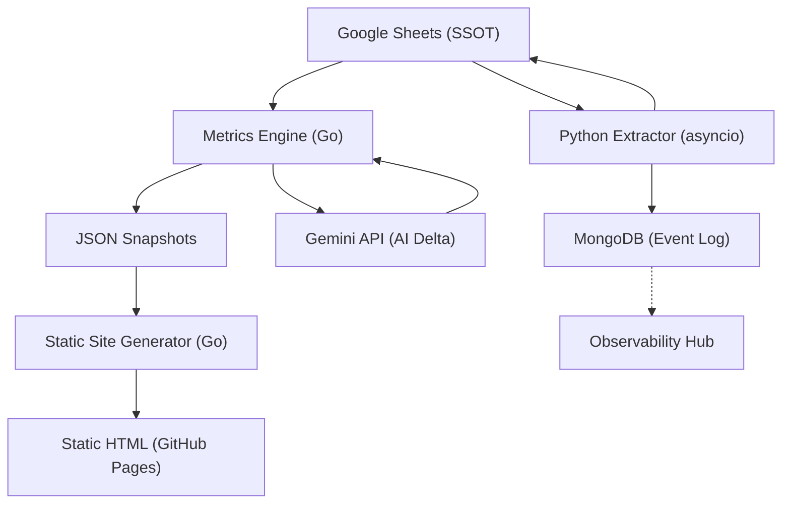

# Personal Reading Analytics

Personal Reading Analytics is a fully automated data pipeline and static dashboard built with Go, Python, MongoDB, Google Sheets, and Google Gemini.

It supports asynchronous configuration-driven extraction, multi-pass historical static site generation, and AI-powered weekly narrative insights, all operating within a serverless CI/CD workflow.

[Live Project](https://victoriacheng15.github.io/personal-reading-analytics/) | [Full Documentation](./docs/README.md)

---

## Case Studies

| Case Study | Problem | How it was diagnosed | Result |
| :--- | :--- | :--- | :--- |
| [Dual-mode RSS/HTML extraction](./docs/decisions/001-prefer-rss-over-html-scraping.md) | Brittle HTML DOM scraping frequently broke when class names changed, increasing bandwidth and maintenance overhead. | Tracked selector-based pipeline failures and compared payload size and stability against XML endpoints as documented in [ADR 001](./docs/decisions/001-prefer-rss-over-html-scraping.md). | Priority is shifted to stable RSS/Atom feeds with a Dual-Mode Extractor that dynamically branches logic based on the feed type. |
| [Static historical archives](./docs/decisions/003-static-historical-metrics.md) | Previous reading metrics were overwritten and lost to the frontend on each update, preventing historical browsing. | Identified that building only the latest metrics JSON limited long-term visual trends as analyzed in [ADR 003](./docs/decisions/003-static-historical-metrics.md). | Re-engineered the Go generator to run a multi-pass build over all archived snapshots, generating a browsable relative-linked history under `/history/`. |
| [Configuration-driven extraction engine](./docs/decisions/004-universal-configuration-driven-extraction.md) | Site-specific Python parsing functions caused significant bottlenecks and code duplication when onboarding new sources. | Measured scaling bottlenecks as tracked blogs reached dozens, requiring a new code deployment for each source in [ADR 004](./docs/decisions/004-universal-configuration-driven-extraction.md). | Replaced site-specific logic with a heuristic-driven extraction engine (`universal_html_extractor`) controlled via the Google Sheets SSOT. |

---

## Architecture

The platform executes three primary data and analytics pipelines:

| Stage | Operational Purpose | Flow |
| :--- | :--- | :--- |
| **Extraction (Python)** | Asynchronous metadata harvesting from RSS and HTML feeds | Google Sheets (SSOT) -> Python Extractor -> MongoDB Event Store & Google Sheets |
| **Metrics (Go)** | Quantitative processing and AI delta narrative generation | Google Sheets -> metrics.exe -> Gemini AI Delta -> JSON Snapshots |
| **Dashboard (Go)** | Multi-pass static site generation and asset compilation | JSON Snapshots -> analytics.exe -> Static HTML -> GitHub Pages |


```mermaid
graph TD
    SSOT["Google Sheets (SSOT)"]
    Ext["Python Extractor (asyncio)"]
    Mongo["MongoDB (Event Log)"]
    Metrics["Metrics Engine (Go)"]
    Gemini["Gemini API (AI Delta)"]
    JSON["JSON Snapshots"]
    Gen["Static Site Generator (Go)"]
    Page["Static HTML (GitHub Pages)"]
    Hub["Observability Hub"]

    SSOT --> Ext
    Ext --> SSOT
    Ext --> Mongo
    SSOT --> Metrics
    Metrics --> Gemini
    Gemini --> Metrics
    Metrics --> JSON
    JSON --> Gen
    Gen --> Page
    Mongo -.-> Hub
```

---

## Tech Stack

| Layer | Tools |
| :--- | :--- |
| Languages | Go, Python, HTML, CSS |
| Data & APIs | Google Sheets API, MongoDB (event store), Google Gemini API |
| Visualization | Chart.js (interactive dashboards) |
| DevOps & CI/CD | GitHub Actions (scheduled execution), GitHub Pages (hosting), Docker, Nix |
| Testing & Quality | pytest (Python), go test (Go), ruff, markdownlint |

---

## Documentation

- [Architecture](./docs/architecture/README.md)
- [Platform Workflows](./docs/workflows.md)
- [Decisions](./docs/decisions/README.md)
- [Experiments](./docs/experiments/jenkins.md)

---

## Local Setup

### Python (Extraction)

Setup local virtual environment:

```bash
make install
```

Run extraction locally:

```bash
make py-run
```

Run Python linting and tests:

```bash
make lint-py
make test-py
```

### Go (Metrics & Dashboard)

Calculate metrics locally:

```bash
make metrics-build
```

Build the static dashboard locally:

```bash
make web-build
```

Run Go formatting and tests:

```bash
make fmt-go
make test-go
```
